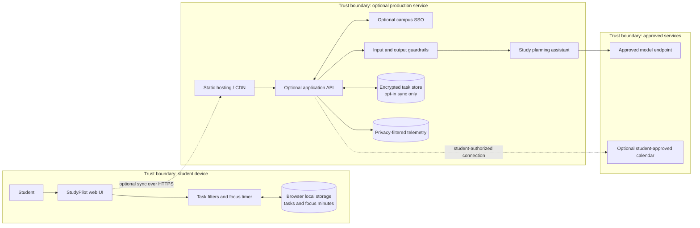
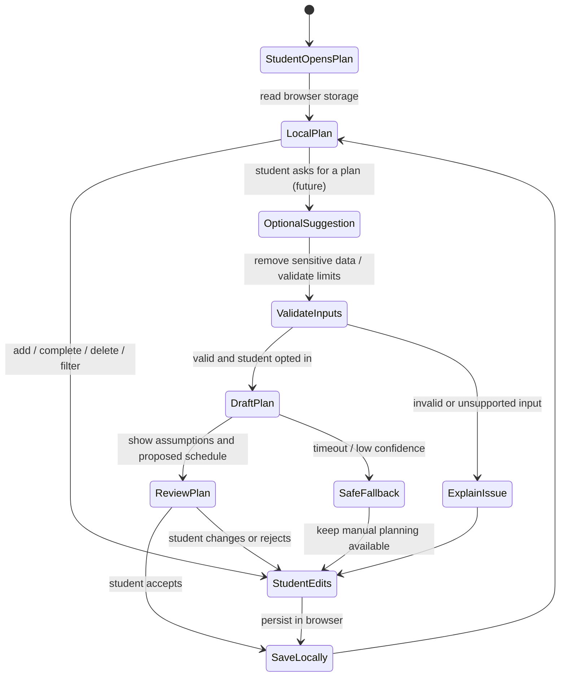

StudyPilot — Capstone Deliverables

Student: Ramya A L
Roll number: 2023103540
Application: StudyPilot — offline study planner and focus timer
Deployment link: [Open the live StudyPilot app](https://ramyaal3362.github.io/studypilot-capstone./2023103540-Ramya%20A%20L/application/)

Project summary
StudyPilot helps students organize assignments, track completion, and run focus sessions. This deliverable is a browser-only prototype. Its task list and focus minutes are saved in local storage on the current device. There is no sign-in, network request, AI model connection, or external integration in the prototype. The AI agent described below is a proposed production extension; current task management and timer behavior are ordinary local application logic.

## 1. Architecture diagram

The delivered version is entirely inside the **student device** boundary. Hosted components and external services are future options and are not called by the current source code. Local storage is not encrypted or synchronized by the app; students should avoid entering sensitive personal information.

## 2. Agent workflow design

### Roles, tools, and controls

| Role | Responsibility | Authority |
|---|---|---|
| Student | Creates and edits their own tasks; chooses whether to use future suggestions | Full control over their local plan |
| StudyPilot UI | Displays tasks, search, filters, progress, and timer | Local browser data only |
| Optional planning assistant | Breaks a student-selected goal into suggested study blocks | Suggests only; cannot alter a plan without student acceptance |
| Guardrail layer (future) | Validates input, limits scope, removes unsupported claims | Can reject or abstain; cannot schedule on the student's behalf |

The current app does not include an AI assistant. If one is added later, present its suggestions for review, require student confirmation before saving or calendar sync, and provide a manual fallback for model errors, low confidence, or unsupported requests. It must not complete coursework or make academic decisions.

## 3. Deployment strategy

### Current application

The app is a static site with no build step or dependencies. Open `application/index.html` locally, or upload the `application` directory to GitHub Pages, Netlify, or Vercel. The published root must contain `index.html`, `styles.css`, and `app.js` together. No build command is needed.

### Environments and release

- **Local:** open the static page in a modern browser; all features work without internet once the files are present.
- **Preview:** optional static preview from a pull request, using fictional seed tasks.
- **Production:** publish the static directory using HTTPS and immutable versioned releases. No backend is required for the current feature set.
- **Release/rollback:** verify the published page and core interactions, then promote the approved revision; restore the previous static release if a release breaks the interface.

### Growth and resilience

Static assets can be served through a CDN. Local tasks remain available on the same browser and device, but they do not sync and may be lost if browser storage is cleared. If opt-in sync is developed later, use a separately operated API, encrypted storage, export/delete controls, rate limits, backups, bounded retries, and clear offline behavior. Establish service objectives only after operating a hosted service.

### Deployment URL

The app is published with GitHub Pages. Open the [live StudyPilot app](https://ramyaal3362.github.io/studypilot-capstone./2023103540-Ramya%20A%20L/application/). The repository name includes the final period shown in the GitHub repository URL.

## 4. Security model

- **Identity and authorization:** the current local-only prototype has no account system. Browser data is accessible to users of that browser profile. Future sync requires campus SSO and server-side ownership checks.
- **Secrets:** the static prototype contains no keys or credentials. Future API secrets must stay on the server in a managed secret store, never in frontend code.
- **Privacy:** collect no data beyond the tasks the student enters; persist only in local storage. Do not enter sensitive education, health, or account information. Provide future export, clear, and delete controls if synchronization is added.
- **Guardrails:** current version makes no AI-generated recommendations. A future assistant should use only student-approved context, label estimates, abstain when uncertain, and require approval before changing a plan or connecting a calendar.
- **Audit:** no server audit log exists in the local prototype. If cloud sync is introduced, log access and administrative actions with minimal metadata and protect those records from student-content exposure.
- **Browser safety:** validate required fields and escape user-provided text before display. The app does not call browser notification, location, file, microphone, camera, or clipboard APIs.

## 5. Monitoring dashboard design

For the current static app, use hosting-provider aggregate metrics only. Do not collect task titles or other student-entered content.

| Panel | Metric | Use |
|---|---|---|
| Availability | Page load success and static asset errors | Detect broken or unavailable releases |
| Performance | Page load time and asset delivery latency | Find slow hosting or oversized assets |
| Quality | Voluntary usability feedback and task-action completion rate (aggregate only) | Prioritize confusing interactions |
| Safety and privacy | Reports of unexpected data behavior; privacy incidents | Triage promptly; never capture task text in analytics |
| Cost | Hosting and bandwidth | Check for unusual use as traffic grows |
| Student outcomes | Optional voluntary survey on planning confidence and focus habit | Evaluate usefulness without collecting grades or task content |

If a future assistant backend is deployed, add aggregate suggestion acceptance, abstention, latency, error, model-cost, and safety-review measures. Establish alert thresholds from observed baseline data and keep personal content out of metric labels.

## Run the application

Open `application/index.html` in a modern browser. No installation or sign-in is required. See `application/README.md` for the complete interaction and deployment notes.
